**Abbildung 1:** Beispiele für Embedded Systems mit wachsender Komplexität

[^1]: Alle Bilde sind mit Microsoft Copilot generiert, 2025

# Test

::: {.notes}

- Was bedeutet "Debugging"

  - Wo kommt dieses Wort her?
  - Wer hat das benutzt etc...
  - Figure mit Citazion

- Verschiedene Embedded Systems

  - Kaffeemachine, Flugzeug, Automotive
  - High integrity, and Sicherheit-relevante Systemen

  - Je Komplexer das System, desto großer ist die Anzahl an personen und gruppen die daran arbeiten
    - HW Ingenieure
    - SW Ingenieure
    - System Ingenieure
    - Test Ingenieure
    - Qualitätssicherung
    - Projekt Manager
    - Kunden und Endbenutzer
  - Kommunikation und Zusammenarbeit zwischen diese Gruppe ist kritisch und dort stehen die meisten defekte

:::

- Nehemen wir an, als denkmodell das V modell

- Was ist unterschiedlich wenn man mit Embedded Systems arbeitet?

  - HW & SW und die Probleme konnten auf die zusammen arbeit von beide, z.B.?
    - Timing!!

- Debugging sind häufig eine folge-aktion von ein Defekt

  - Was ist ein Defekt?
  - Haben wir ein Defekt?
  - Soll Verhalten vs. Ist Verhalten
  - Häute sind die meisten System komplexe und haben mehrere Ebene

    - Verschiedene Gruppe, sind für verschieden Subsysteme Verantwortlich

  - Man muss immer zuerst überprufen, das ein Defekt existiert
    - Reproduzierbar?
    - Konsistent?
    - Intermittierend?
    - Also wir haben ein Defekt Report
      - Defekt Report sollte immer eine Beschreibung des Soll Verhaltens und Ist Verhaltens enthalten
        - War den Ist Verhalten richtig verstanden?
        - Auf welchen Anforderung bezieht sich das Soll Verhalten?
        - Welche Test Case(s) wurden benutzt um das Ist Verhalten zu überprüfen?
        - Umgebung Variables (HW, SW, Konfiguration, etc..)?
        - Schritte um den Defekt zu reproduzieren?
      - Priorität und Schweregrad des Defekts?
    - Zuerst, überpfufen wir ob ein Soll Verhaltenes richtig verstanden würde und den Test Case(s) richitig ausgeführ wurde
      - Beispiel mit Auto und Camera Lichtschwer

- Wenn es um komplexe System geht, gibt es häufig mehrere Ebene von Abstraktion

  - HW Ebene, SW Ebene, System Ebene
  - Verschiedene Stakeholder sind verantwortlich für verschiedene Ebene
    - HW Ingenieure, SW Ingenieure, System Ingenieure
  - Kommunikation zwischen diese Gruppe ist kritisch
    - Unterschiedliche Sprache, unterschiedliches Verständnis

- Debugging in Embedded Systems ist häufig eine Team-aktivität

  - Verschiedene Experten bringen verschiedene Perspektiven
  - Zusammenarbeit ist entscheidend
  - Werkzeuge und Techniken zur Unterstützung der Zusammenarbeit

-

- Eine kleine Reise durch die Entwicklung und Testing Phase, das V-Modell

  - Was ist das V-Modell
  - Es gibt Ebene!! Von Höhe Ebene bis zum SW units
  - Anforderungen sind hier generiert

- Zuerst kommt einee Test und Validierungsphase

  - Das System ist getestet anhand von einem Test Design Concept und mehrere Test Cases.
    - Ein Test case ist in der Regeln ein Pärchen von (Input Vectors und Acceptance Regeln)
      - Häufig gibt es Einflussefaktoren, die nicht Meßbar oder Kontrollierbar sind.

- Wenn ein Defekt besteht und wir sehen SW ist involviert, dann wird interessant

  - Verschiedene Debugging Techniken

    - Log Dateien analysieren
    - Debugger benutzen
    - Hardware Debugging Tools (JTAG, SWD, etc..)
    - Trace Analyse
    - Unit Tests und Integration Tests
    - Simulation und Emulation
    - Code Reviews und Pair Programming
    - Static Analysis Tools
    - Dynamic Analysis Tools
    - Monitoring und Profiling Tools
    - Hardware-in-the-Loop (HIL) Testing
    - Fuzz Testing
    - Root Cause Analysis (RCA)
    - Post-Mortem Analysis
    - Fault Injection Testing
    - Performance Analysis Tools
    - Memory Analysis Tools
    - Timing Analysis Tools
    - Communication Protocol Analyzers
    - System Health Monitoring Tools
    - Version Control Systems for Debugging History

  - Tools in automotive: DLT, Trace32, CAN Analyzers, etc..
    - Welche Tool sind am besten für welche Situation?
    - Vor und Nachteile von verschiedene Tools
    - DLT (Beispiel)
      - Logging Framework für Automotive Systeme
      - Vorteile: Standardisiert, Effizient, Flexibel
      - Nachteile: Overhead, Komplexität
  - Warum schreiben wir nicht ein printf and log Datei?

    - Overhead
    - Echtzeit Anforderungen
    - Speicherplatz
    - Performance
    - Sicherheit
    - Log Datei kann nicht alle Informationen enthalten
    - Log Datei kann schwer zu analysieren sein

  - Warum ist DLT performant:
    - Binär Format
    - Kompression
    - Filterung
    - Asynchrone Übertragung
    - Priorisierung

- Wie man debug Embedded Systemen?
  - Tooling dun Techniques sind von Ebene Abhanig

Von Courtesy of the Naval Surface Warfare Center, Dahlgren, VA., 1988. - U.S. Naval Historical Center Online Library Photograph NH 96566-KNThe above link is no longer valid on 13.04.2017, the image available here., Gemeinfrei, https://commons.wikimedia.org/w/index.php?curid=165211

```dot
digraph G {
    # Allgemeine Einstellungen
    rankdir=LR;
    node [shape=box, style="filled,rounded", fillcolor="#e6e6e6", width=2.5, height=0.7];
    edge [arrowhead=vee];

    # Definition der Ebenen
    spec [label="Spezifikation", group=g1];
    impl [label="Implementierung\n(Codierung)", group=g2, fillcolor="#4da6ff"];
    test [label="Test & Integration", group=g3];

    # Linke Seite (Abwärts)
    Req_Sys [label="System-Anforderungen\n(Product Goal)"];
    Arch_Sys [label="System-Architektur\n(HW/SW Partitionierung)"];
    Design_SW [label="SW-Design & Anforderung"];
    Design_HW [label="HW-Design (Schaltplan)"];

    # Rechte Seite (Aufwärts)
    Test_Unit [label="Unit Test", fillcolor="#ccffcc"];
    Test_SW_Int [label="SW-Integrationstest", fillcolor="#ccffcc"];
    Test_HW_Int [label="HW-Inbetriebnahme", fillcolor="#ffcc99"];
    Test_Sys [label="System Test\n(HW+SW)"];

    # Verbindungen Linke Seite (V abwärts)
    Req_Sys -> Arch_Sys;
    Arch_Sys -> Design_SW;
    Arch_Sys -> Design_HW; # HW und SW entstehen aus Architektur
    Design_SW -> impl;
    Design_HW -> impl;

    # Verbindungen Rechte Seite (V aufwärts)
    impl -> Test_Unit;
    Test_Unit -> Test_SW_Int;
    Design_HW -> Test_HW_Int; # Hardware wird separat in Betrieb genommen
    Test_SW_Int -> Test_Sys;
    Test_HW_Int -> Test_Sys; # System Test integriert beide Stränge

    # Visualisierung des "V"
    Req_Sys -> Test_Sys [style=dotted, color=gray, constraint=false];
    Arch_Sys -> Test_SW_Int [style=dotted, color=gray, constraint=false];
    Arch_Sys -> Test_HW_Int [style=dotted, color=gray, constraint=false];
    Design_SW -> Test_Unit [style=dotted, color=gray, constraint=false];

    # Optional: Hervorhebung des Integrationspunkts
    {rank=same; Test_SW_Int, Test_HW_Int}
    {rank=same; Design_SW, Design_HW}
}
```

Quarto enables you to weave together content and executable code into a finished document. To learn more about Quarto see <https://quarto.org>.

